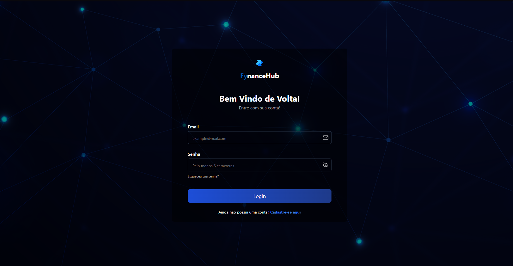

# 💰 FynanceHub

**FynanceHub** é uma aplicação **full stack** desenvolvida para uso pessoal, com o objetivo de facilitar o controle financeiro do meu trabalho como autônomo. A plataforma permite o gerenciamento de entradas e saídas, exibição de gráficos interativos e geração de relatórios em PDF no fim de cada mês — tudo de forma simples, responsiva e segura.

[🔗 Acessar projeto](https://fynance-hub.vercel.app/login)

## 🧠 Sobre o Projeto

Este projeto surgiu da necessidade de ter uma ferramenta própria para acompanhar minha vida financeira profissional. Quis desenvolver algo simples de usar, mas robusto o suficiente para oferecer uma visão clara e prática das minhas finanças — enquanto pratico conceitos importantes como autenticação, APIs REST, manipulação de dados e geração de relatórios.

---

## ✨ Funcionalidades

- ✅ Cadastro e login de usuários com autenticação JWT
- 📊 Dashboard com gráficos de entradas e saídas
- ➕ Adição de receitas e despesas
- 📆 Relatórios financeiros mensais
- 📤 Exportação dos relatórios em PDF
- 📱 Interface 100% responsiva

---

## 🛠️ Tecnologias Utilizadas

### Front-end
- Next
- TailwindCSS
- React Hook Form
- Zod
- shadcn/ui
- Recharts 
- Axios

### Back-end
- Node.js
- Express.js
- PostgreSQL
- Prisma
- JWT (autenticação)
- Bcrypt (criptografia de senhas)
- jsPDF

---

## 📷 Demonstração

> 
> 

---


## 🚀 Como Executar o Projeto

### 1. Clone o repositório

```bash
git clone https://github.com/seu-usuario/fynancehub.git
```

### 2. Instale as dependências

Backend:

```bash
cd fynancehub/backend
npm install
npm start
```

Frontend:
```bash
cd fynancehub/frontend
npm install
npm run dev
```

### 3. Configure as variáveis de ambiente
Crie um arquivo .env na raiz da pasta backend com as seguintes variáveis:
```bash
PORT=5000
DATABASE_URL=sua_string_de_conexão_do_postgresql
JWT_SECRET=sua_chave_secreta_jwt
```
⚠️ Certifique-se de que o banco de dados PostgreSQL esteja rodando antes de iniciar o back-end.

---

## 📌 Status do Projeto
✅ Projeto funcional e pronto para uso pessoal
⚙️ Aberto a melhorias e refatorações futura